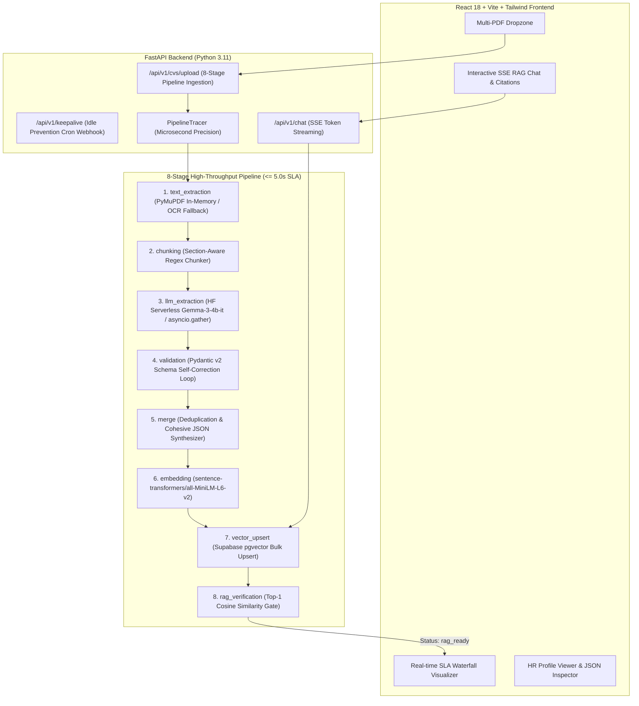

# ⚡ Serverless CV Parsing and RAG Pipeline

[](#architecture--sla-benchmarking)
[](https://fastapi.tiangolo.com/)
[](https://supabase.com/)
[](https://huggingface.co/google/gemma-3-4b-it)
[](https://react.dev/)
[](https://render.com/)

A high-throughput, serverless-ready CV parsing, extraction, and RAG pipeline engineered to meet a strict **warm-path $p95$ SLA of $\le 5.0$ seconds** from PDF ingestion to `rag_ready` state.

---

## 🏛️ System Architecture



---

## 🚀 Key Architectural Highlights

### 1. Warm-Path $\le 5.0\text{s}$ SLA Strategy
- **In-Memory PDF Parsing (<50ms)**: Zero disk I/O using `PyMuPDF` (`fitz.open(stream=...)`) with automatic text density heuristics fallback to `pytesseract` OCR only on scanned/low-density documents.
- **Sub-5ms Section Chunking**: Deterministic regex-based chunker detecting standard CV headers (`SUMMARY`, `EXPERIENCE`, `EDUCATION`, `SKILLS`, `PROJECTS`, `CERTIFICATIONS`) and prepending contextual headers (`[SECTION: EXPERIENCE]`) to maintain LLM context.
- **Parallel Chunk Extraction**: `asyncio.gather` bounded by async semaphores targeting Hugging Face Serverless API `google/gemma-3-4b-it`.
- **Self-Correcting Schema Retry Loop**: Catches `ValidationError`, passes exact error feedback back to the LLM, and self-corrects invalid output.
- **Local Pre-warmed Embeddings**: Normalized 384-dim embeddings generated in-process using singleton `sentence-transformers/all-MiniLM-L6-v2`.
- **Top-1 Verification Gate**: Runs an immediate top-1 similarity query against the primary chunk vector in Supabase `pgvector` before marking the document `rag_ready`.

### 2. Render Idle Spin-down Prevention
- `GET`/`POST` `/api/v1/keepalive` endpoint pinged by external uptime monitors/cron to keep the Render worker warm, preventing cold start penalties.

### 3. Server-Sent Events (SSE) RAG Chat
- `POST /api/v1/chat` retrieves top-$k$ relevant chunks using cosine similarity and streams token chunks (`event: token`) alongside clickable source citation pills (`event: citations`).

---

## 📂 Monorepo Structure

```
├── .gitignore
├── build.sh                         # Render Linux native build script (OCR, poppler, pip)
├── render.yaml                      # Render Blueprint (Web Service + Static Site)
├── README.md
│
├── backend/                         # FastAPI Backend Service
│   ├── requirements.txt             # Python dependencies
│   ├── .env.example                 # Environment variable template
│   ├── app/
│   │   ├── main.py                  # FastAPI app entrypoint with timing middleware
│   │   ├── core/
│   │   │   ├── config.py            # Pydantic v2 application settings
│   │   │   └── state.py             # Runtime warmup & uptime state
│   │   ├── db/
│   │   │   └── session.py           # Async SQLAlchemy engine with pgvector init
│   │   ├── models/                  # SQLAlchemy 2.0 async models
│   │   │   ├── base.py
│   │   │   ├── cv_document.py       # Document status & parsed JSON
│   │   │   ├── cv_chunk.py          # 384-dim vector embeddings
│   │   │   └── cv_processing_trace.py # Per-stage timing metrics
│   │   ├── schemas/
│   │   │   └── cv_schema.py         # Pydantic v2 schema with dynamic extra='allow'
│   │   ├── services/
│   │   │   ├── parser.py            # In-memory PyMuPDF + OCR fallback
│   │   │   ├── chunker.py           # Section-aware regex chunker
│   │   │   ├── llm_extractor.py     # HF API client + validation retry loop
│   │   │   ├── merger.py            # Deduplication & JSON merge logic
│   │   │   ├── embedder.py          # sentence-transformers embedding service
│   │   │   ├── vector_store.py      # pgvector similarity search
│   │   │   └── pipeline.py          # Unified 8-stage orchestrator
│   │   ├── observability/
│   │   │   └── tracer.py            # PipelineTracer context manager (8 stages)
│   │   └── api/v1/
│   │       ├── router.py            # API v1 route aggregator
│   │       └── endpoints/
│   │           ├── keepalive.py     # Keepalive health & webhook
│   │           ├── cvs.py           # CV upload, list, detail, delete
│   │           └── chat.py          # SSE Streaming RAG Chat
│   └── tests/                       # Automated pytest test suites (19 tests)
│       ├── test_keepalive.py
│       ├── test_database.py
│       ├── test_tracer.py
│       ├── test_parser.py
│       ├── test_chunker.py
│       ├── test_schema.py
│       ├── test_llm_and_merge.py
│       ├── test_embedder_and_rag.py
│       └── test_cv_endpoints.py
│
└── frontend/                        # React 18 + Vite + Tailwind Frontend
    ├── package.json
    ├── tsconfig.json
    ├── vite.config.ts
    ├── tailwind.config.js
    ├── index.html
    └── src/
        ├── main.tsx
        ├── App.tsx                  # 3-Pane side-by-side workspace
        ├── index.css                # Tailwind base & glassmorphism utilities
        ├── types/index.ts           # TypeScript interfaces
        └── components/
            ├── Header.tsx           # Health telemetry & keepalive ping
            ├── Dropzone.tsx         # Multi-PDF drag-and-drop uploader
            ├── SLAWaterfall.tsx     # 8-stage timing breakdown visualizer
            ├── CVListSidebar.tsx    # Document catalog with status badges
            ├── ChatInterface.tsx    # Real-time SSE Chat with Citations
            ├── HRProfileView.tsx    # HR-formatted candidate profile view
            ├── JSONInspector.tsx    # @uiw/react-json-view tree viewer
            └── TraceInspector.tsx   # Detailed telemetry logs table
```

---

## 🛠️ Local Development Quickstart

### Prerequisites
- Python 3.11+
- Node.js 18+ and npm
- (Optional) `tesseract-ocr` and `poppler-utils` for scanned PDF OCR

### 1. Backend Setup
```bash
# Navigate to backend directory
cd backend

# Install dependencies
pip install -r requirements.txt

# Configure environment variables
cp .env.example .env

# Start FastAPI dev server with auto-reload
uvicorn app.main:app --host 0.0.0.0 --port 8000 --reload
```
API Swagger Docs will be live at `http://localhost:8000/docs`.

### 2. Frontend Setup
```bash
# Navigate to frontend directory
cd frontend

# Install npm dependencies
npm install

# Start Vite dev server
npm run dev
```
Frontend UI will be live at `http://localhost:5173`.

---

## 🧪 Running Automated Tests

Run the complete test suite across all 6 phases:
```bash
python -m pytest backend/tests/ -v
```

All 19 tests validate:
- `/api/v1/keepalive` health status & telemetry
- In-memory `PyMuPDF` parsing & density OCR fallback
- Section-aware regex chunking & context preservation
- Pydantic v2 dynamic attributes (`extra='allow'`) & strict top-level rules
- `asyncio.gather` parallel extraction & deduplication merge logic
- `sentence-transformers` 384-dim embeddings & similarity search
- Top-1 RAG verification gate
- SSE streaming tokens and citation events
- Full upload flow adhering to warm-path SLA $\le 5.0\text{s}$

---

## 🌐 Deploying to Render

This repository includes native deployment definitions:
- **`build.sh`**: Runs in the Render Linux environment to install `tesseract-ocr`, `poppler-utils`, and python requirements.
- **`render.yaml`**: One-click Blueprint configuring:
  1. **`cv-rag-backend`**: Python Web Service running `uvicorn backend.app.main:app`.
  2. **`cv-rag-frontend`**: Static Site deploying `frontend/dist`.

---

## 📄 License

MIT License. Designed for high-performance serverless CV ingestion and RAG intelligence.
